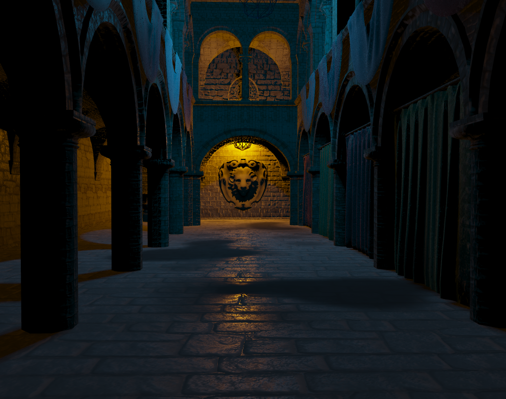

# Peter Dravecky - Assignment - s5305642

## A Simple Open-GL Renderer
My final assignment is a basic Open-GL renderer. Currently this program supports or implements the following features:

- **Forward & Deferred Rendering**
- **Multiple Light PBR shading**
- **Point Lights & Omni-Directional Shadow Mapping**

- **Scene Management using a Scene Graph structure**
- **Loading in triangular meshes + tangent & bi-tangent calculation**

- **UI for setting object & scene properties**
- **Multiple sample scenes for testing**

### The Research
As I haven't worked in OpenGL or Qt before, research was a vital part of the whole development process. 
As a starting point I worked through most of the [OpenGL tutorials by Joey de Vries](https://learnopengl.com/), 
trying to implement them using first pure OpenGL and then the NGL library. Other learning resources included different topics on [StackOverflow](https://stackoverflow.com/), 
a couple of papers to gain better understanding of the techniques I was implementing, mostly the different equations when it came to shadow mapping and deferred rendering.

I implemented a couple of other features, like tangent and bi-tangent calculations, using code examples from the [NCCA Git Repository](https://github.com/NCCA).

Big inspiration for steering this project towards more of a rendering approach were [Game Engine Render Pipeline Breakdowns](https://c0de517e.blogspot.com/2020/12/hallucinations-re-rendering-of.html?fbclid=IwAR2ormYABxSHjw7H7aay29P_bpg4LJ5kkExVD1TaYSELwOYshFkme9s6uSE) we got shown in class - they helped me to understand what goes behind the scenes of a rendering engine.

Learning QT mostly came from reading their extensive [documentation](https://doc.qt.io/). 

### Base Structre

#### Main Classes
##### QT Widgets
- **NGLScene** - as in NGL demos, this class is a QTWidget which handles rendering the scene. Since it is the base of our OpenGL context, in my program it also contains all the functions which relate to rendering to the screen - different types of **rendering**, **shadow mapping**, **scene loading**. These functions have been put into separate .cpp files to make them more readable - *NGLSceneRendering.cpp* (rendering functions, initializing gBuffer & render textures), *NGLShadowMapping.cpp* (creating cubemaps, rendering the shadow pass), *NGLSceneAssets.cpp* (creating individual scenes using SceneManager commands, loading default textures, preparing default primitives)

- **NGLSceneTreeView** - this is the widget which handles the **Scene Graph** list. Since Qt doesn't have a specific TreeView class, I had to create my own one as a derived class of *QAbstractTreeView*. NGLTreeView and SceneTreeModel handle the organisation of objects in the Scene Graph hierarchy - **removing objects**, getting the index of currently selected object, etc.
- **NGLObjectMenu** - this widget manages the side menus which provide the user with an interface to change object parameters, like the **material**, **transforms**, **light information**, etc. It sets up proper connections for setting their parameters through the QT context.
- **NGLSceneMenu** - responsible for changing scene parameters, like **render type** and **shadow resolution**. To change the type of renderer our scene uses, it accesses *m_renderExec*, which is a function pointer to a member function of NGLScene. the context of this pointer gets called every paintGL, so switching up the function inside the pointer provides a more elegant way to handle this than a lot of if statements in the update function. (if that's not true and it's actually really unsafe or something please let me know thank you)

##### Scene Management
- **SceneObject** - *SceneLight*, *SceneMesh* - this class and its derived types refer to the specific **invidual objects** that we have in the scene. They get passed all around the program as *shared pointers*, and provide access to getting or setting the different properties objects in the scene have.
- **SceneManager** - this is a static function which functions as a connection between all the different parts of the program. It holds pointers to every Qt widget in the scene and contains functions which require communication between them, e.g. *addObject* - creates a VAO, but also adds a new item to the scene graph.

#### Rendering
This renderer supports both **deferred** and **forward** rendering - initially I wanted to explore Forward+/other combinations of both, but due to the lack of time I settled on just making both and testing out how they perform on same scenes. Deferred rendering took a while to implement, but after much trial and error I managed to get both of them to provide the same results. For testing I have created functions for quickly switching between the textures of the GBuffer and rendering them onto the screen, as well as switching between deferred and forward rendering. Subsequently I added some other options for rendering out **shadow maps** and **wireframe**, for both debugging and providing an interesting visual output.

#### Multiple Point Lights
Using one of the NGL examples I created support for loading in multiple point lights to the shader to provide more realistic looking lighting calculations. Same as in the examples, this was achieved by loading in **arrays of light information**, and resizing those arrays + **recompiling the shader** every time the number of lights changes.

#### PBR shading
Using the previously mentioned [LearnOpenGL Tutorials](https://learnopengl.com/PBR/Theory), I implemented a basic PBR shading model. It supports loading in albedo, occlusion/roughness/metallic, normal and emissive textures, with additional multiplier parameters for each one. Unfortunately, I didn't have time to completely finish it and include things like [Diffuse Irradiance](https://learnopengl.com/PBR/IBL/Diffuse-irradiance).

#### Shadow Mapping
After initially testing out shadow-mapping using a directional light and a simple 2D texture, I proceeded to implement **omni-directional point light shadow-mapping** using cubemaps and geometry shaders to project the scene onto every side of the cube in a single shader pass. My next goal would be to turn this output cubemap into an array of atleast 4 point lights - my renderer currently only supports one shadow caster, which is always the last light loaded into the scene. I did have time to implement some optimizations, like **Percentage Closer Filtering** and **front culling** to remove some of the more apparent shadow artifacts.

#### Deferred vs. Forward Experiment
During my implementation of deferred rendering I learnt that deferred rendering is preferred for lighting calculations with many point lights & objects in the scene, therefore I wanted to test if my implementations held by the same rules. I have included a scene called *Light Stress Test*, which includes about 300 Utah teapots and as many point lights randomly floating in space. While rendering this scene there was about 20 FPS difference between the deferred shader and the forward shader, which was very noticeable. Of course, my program isn't perfectly optimized, so I bet with a proper renderer that would definitely be even more.

#### Optimization
Although I am not an experienced C++ user, I tried my best to keep everything tidy and prevent unwanted performance impacts and memory leaks. I made sure that during memory heavy allocations, like creating textures (or anything to do with OpenGL), I properly disposed of the leftover data after it was no longer needed.

In terms of performance there could definitely be some improvements. There is definitely a lot of unnecessary passing of uniform data into the shaders, mostly when it comes to light information matrices and shadow maps, which are also the most performance intensive ones. Despite this the program runs fairly well even with dense geometry and textures loaded in, which I consider a success.

#### Improvements
I hope to get more time to work on this project after the assignment and polish some of the parts left unfinished and add features which I would like to learn about.
Some of those things include:
- **Camera Movement** - very clunky at the moment
- **Multiple Light Shadow-Mapping**
- **HDRI Support**
- **Post-Processing - Anti-Aliasing, SSAO, Bloom**

#### Conclusion
To sum up, I am really happy with how this project turned out. It was definitely a big learning experience, that I hope to build upon in the nearby future. I am dissatisfied with some parts of the program, which were either made in a rush or just with inexperience, but overall I believe I created a project which satisfies the criteria and provides a good visual result.

